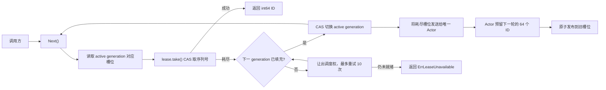

# snowflake-id

`snowflake-id` 提供两个完全隔离的 64 位 ID 生成包，使用“时间戳 + 机器 ID + 序列号”生成非负、可解析的 `int64` ID：

- `actor` 子包：固定 64 槽环形队列，每个生成器只有一个 `ext.Actor` 异步回填；
- `mutex` 子包：保留原始实现，当前号段耗尽时使用互斥锁同步续租。

> [!IMPORTANT]
> - 每个进程或生成器必须使用独占的 `machineID`；本项目不负责跨进程分配机器 ID。
> - `machineID` 的有效范围是 `0`～`1023`，单个机器 ID 的格式上限是每毫秒 `4096` 个 ID。
> - 构造和解析必须传入同一个自定义纪元 `time.Time`；系统时钟回拨会在预留新号段时返回 `ErrInvalidTimestamp`。
> - Actor 版和 Mutex 版之间不会协调机器 ID；同时使用时也必须分配不同的 `machineID`。

## 项目介绍

项目采用类似 Snowflake 的 63 位非负整数布局，并通过 64 个 ID 的内部号段降低并发生成时的锁竞争。

| 能力 | 取值 |
| --- | --- |
| ID 类型 | 非负 `int64` |
| 自定义纪元 | 由调用方传入 `time.Time`，按毫秒截断 |
| 时间戳 | 41 位，毫秒精度 |
| 机器 ID | 10 位，共 1024 个取值 |
| 序列号 | 12 位，每毫秒 4096 个取值 |
| 单机器格式上限 | 4,096,000 ID/秒 |
| 最大支持时间 | 自定义纪元之后约 69.7 年 |
| 默认内部号段 | 64 个 ID |

ID 的位布局如下：

```text
 62                    22 21          12 11             0
+------------------------+--------------+----------------+
| 41-bit timestamp delta | machine ID   | sequence       |
+------------------------+--------------+----------------+
          41 bit             10 bit          12 bit
```

编码公式：

```text
ID = ((unixMilliseconds - epoch.UnixMilli()) << 22)
   | (machineID << 12)
   | sequence
```

适合以下场景：

- 单进程内多 goroutine 并发生成 ID；
- 已有机器 ID 分配机制的多实例服务；
- 需要从 ID 中还原生成时间、机器 ID 和序列号；
- 需要一次获取固定 64 个连续 ID 的批处理任务。

## 快速开始

项目要求 Go 1.27 或更高版本。

安装：

```bash
go get github.com/da123wda/snowflake-id/actor
```

下面的示例演示单个 ID、解析和批量生成：

```go
package main

import (
	"fmt"
	"log"
	"time"

	actorid "github.com/da123wda/snowflake-id/actor"
)

func main() {
	epoch := time.Date(2025, 1, 1, 0, 0, 0, 0, time.UTC)

	// 42 必须在所有同时运行的生成器中保持唯一。
	// Actor 邮箱容量由包内固定为 64。
	generator, err := actorid.NewActor(42, epoch)
	if err != nil {
		log.Fatal(err)
	}

	value, err := generator.Next()
	if err != nil {
		log.Fatal(err)
	}

	parsed, err := actorid.Parse(value, epoch)
	if err != nil {
		log.Fatal(err)
	}
	fmt.Printf("id=%d time=%s machine=%d sequence=%d\n",
		value,
		parsed.V0.UTC().Format(time.RFC3339Nano),
		parsed.V1,
		parsed.V2,
	)

	batch, err := generator.NextBatch()
	if err != nil {
		log.Fatal(err)
	}
	fmt.Printf("batch size=%d first=%d last=%d\n",
		len(batch),
		batch[0],
		batch[len(batch)-1],
	)
}
```

`Parse` 返回 `ext.T3[time.Time, int64, int64]`：

| 字段 | 含义 |
| --- | --- |
| `V0` | ID 对应的 UTC 时间 |
| `V1` | 机器 ID |
| `V2` | 毫秒内序列号 |

### 并发使用

一个 `ActorGenerator` 可以被多个 goroutine 共享。在前一个示例中增加 `sync` import 后，可以加入以下函数：

```go
func generateConcurrently(generator *actorid.ActorGenerator, consume func(int64)) {
	var wg sync.WaitGroup
	for range 100 {
		wg.Go(func() {
			value, err := generator.Next()
			if err != nil {
				log.Printf("generate ID: %v", err)
				return
			}
			consume(value)
		})
	}
	wg.Wait()
}
```

并发调用保证 ID 唯一，但不保证按照 goroutine 完成顺序全局单调。若业务要求严格的消费顺序，需要在调用层串行化。

### 使用原始 Mutex 版

```go
import mutexid "github.com/da123wda/snowflake-id/mutex"

epoch := time.Date(2025, 1, 1, 0, 0, 0, 0, time.UTC)
generator, err := mutexid.NewMutex(43, epoch)
value, err := generator.Next()
```

`actor` 与 `mutex` 是两个完全独立的包。`mutex.Next` 热路径同样使用原子 CAS，仅在当前 64-ID 号段耗尽时加锁续租。

## 公开 API

| API | 说明 |
| --- | --- |
| `NewActor(machineID, epoch)` | 使用自定义纪元创建唯一 Actor 的生成器；邮箱容量固定 64 |
| `(*ActorGenerator).Next()` | 从当前环形号段原子取号 |
| `(*ActorGenerator).NextBatch()` | 返回 64 个严格递增且属于同一毫秒的 ID |
| `Parse(value, epoch)` | 使用生成时的自定义纪元解析时间、机器 ID 和序列号 |
| `MaxMachineID` | 最大机器 ID，值为 `1023` |
| `IDsPerMillisecond` | 每毫秒序列容量，值为 `4096` |
| `MaxTimestampDeltaMilliseconds` | 纪元之后可编码的最大毫秒差 |

可能返回的公开错误：

| 错误 | 触发条件 |
| --- | --- |
| `ErrInvalidMachineID` | 机器 ID 小于 0 或大于 1023 |
| `ErrInvalidTimestamp` | 当前时间早于纪元、发生回拨或超过最大时间 |
| `ErrInvalidID` | `Parse` 收到负数 ID |
| `ErrLeaseUnavailable` | 号段队列暂时断供，调用方可以重试 |

`ActorGenerator` 不提供关闭 Actor 的 API，适合作为服务进程内的长生命周期实例。一个生成器实例在构造时只创建一个 Actor，后续所有耗尽号段都提交给该 Actor 回填。

`mutex` 子包独立公开 `NewMutex`、`MutexGenerator`、`Parse` 以及同布局常量和基础校验错误。

## 内部实现

核心代码职责：

| 文件 | 职责 |
| --- | --- |
| `actor/layout.go` | Actor 包的纪元、位宽、掩码和偏移量 |
| `actor/state.go` | Actor 包校验时间并预留连续序列号范围 |
| `actor/lease.go` | 保存 64 个 ID 的内部号段，通过原子 CAS 并发取号 |
| `actor/lease_queue.go` | 固定 64 槽环形队列、无锁切换和 Actor 回填 |
| `actor/generator.go` | Actor 生成器初始化、唯一 Actor 和批量生成 |
| `actor/parse.go` | Actor 包解析 ID |
| `mutex/` | 完全独立的原始互斥锁续租包 |

### `Next` 生成流程



生成器持有固定的 64 个槽位，每个槽位包含 64 个 ID，总容量正好是每毫秒的 4096 个序列号：

1. `active` 是单调递增的 generation，槽位索引为 `generation % 64`，避免环形复用的 ABA 问题；
2. 常用路径只有槽位原子指针读取和 `lease.take` CAS；
3. 当前号段耗尽时，只有成功 CAS 切换 generation 的调用者提交旧槽位；
4. 每个生成器只有一个 `ext.Actor`，Actor 每次回填 64 个 ID，不参与逐 ID 协调；
5. Actor 函数在构造时按槽位创建并复用，持续取号路径没有临时闭包分配；
6. 下一槽尚未就绪时让出调度权重试 10 次，仍未就绪则返回可重试的 `ErrLeaseUnavailable`。

Actor 回填和 `NextBatch` 使用同一个 `ActorGenerator.mu` 更新 `idState`，因此不会预留重叠的序列号。`Next` 的逐 ID 消费及 generation 切换不获取该锁。

### `NextBatch` 生成流程

`NextBatch` 不消费环形队列中的 active 号段，而是在同一个 `idState` 上持锁预留新的 64 个序列号，再一次性构造 `ext.Vec[int64]`。因此它可以和 `Next` 并发混用且不会重复，但每批会分配一个 64 元素切片，即 512 字节。

### 序列耗尽与时钟回拨

`idState.reserve` 是时间和序列状态的唯一更新点：

- 当前毫秒仍有足够序列号时，直接更新 `sequence`；
- 剩余序列号不足以容纳完整号段时，整个号段移到下一毫秒，序列从 0 开始；
- 距离下一毫秒超过 200 微秒时先休眠，接近边界后使用 `runtime.Gosched` 让出调度权；
- 新时间戳小于 `lastTimestamp` 时返回 `ErrInvalidTimestamp`；
- `Next` 已缓存号段时不会读取系统时间，因此回拨会延迟到 Actor 回填时被发现；队列已缓存的 ID 仍可继续返回。

初始化会预留完整的 4096 个 ID。以 50,000 ID/s 消费时，队尾 ID 的时间戳可能比实际取号时间早约 81.92 ms；长时间空闲后滞后可能更大。ID 仍保持唯一，但不应把解析出的时间当作精确调用时刻。

全局唯一性最终依赖以下两个条件：

1. 同一个 `machineID` 在所有进程和生成器之间独占；
2. 系统时间不回拨，或调用方在收到 `ErrInvalidTimestamp` 后停止生成并修复时钟。

## 性能测试

以下结果于 2026-08-25 在本机重复运行 5 次并取中位数：

| 环境 | 值 |
| --- | --- |
| CPU | AMD Ryzen 7 4800H，8 核 16 线程 |
| OS/架构 | Windows / amd64 |
| Go | go1.27.0 |
| 并发度 | `GOMAXPROCS=16` |
| Benchmark 时间 | 每项 `1s`，重复 `5` 次 |

| 场景 | 中位数 | 换算吞吐 | 内存分配 |
| --- | ---: | ---: | ---: |
| Actor `Next` 缓存号段热路径 | 5.124 ns/ID | 195.16 M op/s | 0 B/op，0 allocs/op |
| Actor `Next` 预填充队列内每轮 1000 个 ID | 5.828 ns/ID | 171.59 M op/s | 0 B/op，0 allocs/op |
| Actor `Next` 并行持续生成 | 244.0 ns/ID | 4.10 M ID/s | 0 B/op，0 allocs/op |
| `NextBatch` 并行持续生成 | 244.2 ns/ID | 4.10 M ID/s | 每批 512 B、1 alloc |

并行持续结果已经接近 12 位序列号决定的单机器格式上限 4.096 M ID/s。热路径和短突发结果用于观察代码开销，它们刻意排除了持续运行时的每毫秒格式上限，不能作为单机器长期吞吐。

单独运行 50,000 个 ID 的性能门槛测试，5 次中位数为 `12.1834 ms`，即 `4,103,945 ID/s`，高于测试要求的 `50,000 ID/s`。该短样本会受到起止毫秒边界影响，应以并行持续 Benchmark 评估长期吞吐。

复现代表性 Benchmark：

```bash
go test -run "^$" \
  -bench "^BenchmarkActor(NextCachedHotPath|NextSustained|NextShortBatch|NextBatchParallelSustained)$" \
  -benchmem -benchtime=1s -count=5
```

复现吞吐门槛测试：

```bash
go test -run "^TestActorGenerates50000IDsPerSecond$" -v -count=5
```

性能结果会受到 CPU 调频、系统负载、Go 版本和调度器状态影响；比较改动前后性能时应在同一台机器上交替运行并关注多次结果分布。

## 测试

运行完整测试：

```bash
go test ./...
```

测试覆盖机器 ID 边界、时间边界、时钟回拨、序列耗尽、并发唯一性、号段续租、`Next` 与 `NextBatch` 混用，以及最大 `int64` ID 的解析。
